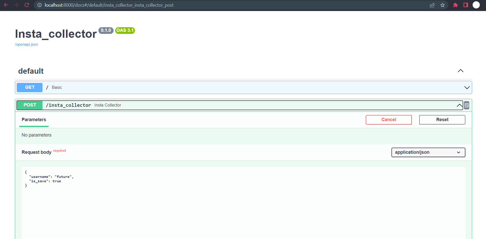
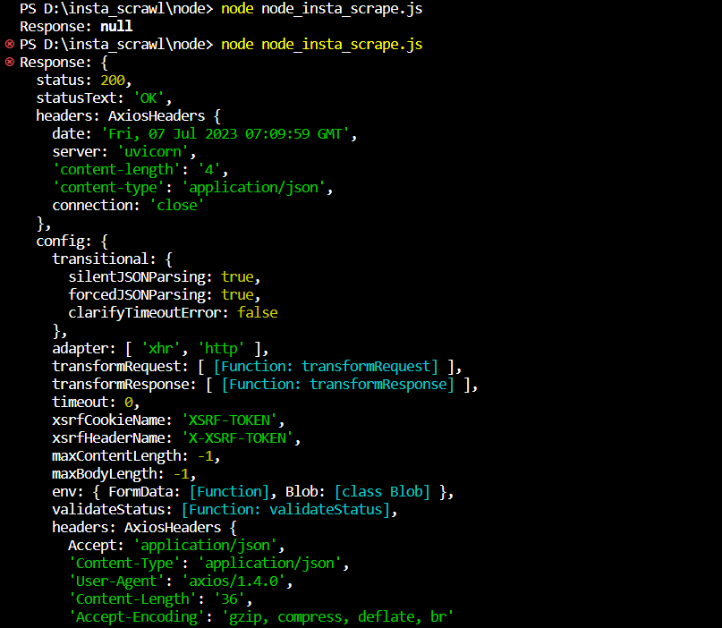
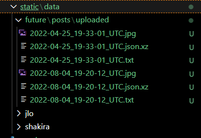

# Instagram Scraper with FastAPI and Node.js

This project is a web application built using FastAPI and Node.js that allows you to scrape Instagram user posts at regular intervals, save the downloaded posts to a local directory, and generate a CSV file for each user containing the scraped data.

## Features

- Automatic scraping: The application uses FastAPI's scheduler functionality to scrape Instagram user posts every 24 hours automatically.
- Instagram scraping: The project utilizes Node.js and its libraries to interact with Instagram's API and retrieve user posts.
- Post downloading: The scraped Instagram posts are downloaded and stored in a local directory on the server.
- CSV file generation: The project creates a CSV file for each user, named after their username, to store the relevant information about the scraped posts.

## Installation and Setup

1. Clone the repository:

   ```
   git clone https://github.com/jayeshthk/insta_scraper_Vavodigital.git
   ```

2. Install the dependencies for both the FastAPI and Node.js components:

   ```
   cd insta_scraper_Vavodigital
   pip install -r requirements.txt
   cd node
   npm install
   ```

3. Set up the  fastAPI -schedulers (optional):

   -  Fastapi-schedulers are enabled by default which is able to scrape the insta-user provided in post JSON on (http://0.0.0.0:8000/insta_collector)
   - You can comment on the code to disable the above feature, here (https://github.com/jayeshthk/insta_scraper_Vavodigital/blob/1b0756cd60c74b423061ebba6476e6d8d78f5eb0/main.py#L22C1-L23C43)
4. Run the FastAPI server:

   ```
   python main.py
   ```

5. Run the Node.js scraper:

   ```
   cd node
   node node_insta_scrape.js
   ```

## Usage

1. Access the FastAPI application at `http://0.0.0.0:8000` using your preferred web browser.

2. The application will automatically start scraping Instagram user posts every 24 hours.

3. To manually trigger a scrape, send a POST request to the `http://0.0.0.0:8000/insta_collector` endpoint using the user's Instagram username  and is_save as a parameter.

4. The downloaded posts will be saved to the `static/data/{username}` directory, and a CSV file named `{username}.csv` will be generated for each user in parent directory. For example here `future.csv` is generated for the future's Instagram profile.

Note: If you choose not to use the Node.js scraper, you can manually provide the username here (https://github.com/jayeshthk/insta_scraper_Vavodigital/blob/1b0756cd60c74b423061ebba6476e6d8d78f5eb0/node/node_insta_scrape.js#L12C1-L15C3) in the required format. The FastAPI  will still generate the CSV file based on the provided data.

## Screenshots :
### Fastapi running on localhost :


### nodejs runner response :


### Saved images :



## Contributing

Contributions are welcome! If you find any issues or have suggestions for improvements, please open an issue or submit a pull request on the GitHub repository.

## License

